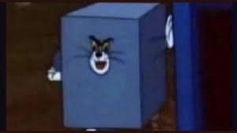

Eu estava em Quixadá na praça do Leão então... Quando tudo escureceu.
Eu estava em Quixadá, na praça do Leão. Vi um grupo de jovens jogando altinha — pareciam universitários, muito animados porque as férias estavam chegando e tinham acabado de concluir a última prova. De repente tudo escureceu.

Depois disso, fui até a sorveteria e pedi uma casquinha de baunilha. Quando olhei para o sorvete, vi algo surreal: havia algo estranho dentro.


E, mais tarde, participei de uma roda de conversa com meus amigos.

## E, mais tarde, participei de uma roda de conversa com meus amigos e familiares.

Eu estava em Quixadá na praça do Leão então, vi um grupo de jovens jogando altinha. Pareciam universitários, estavam muito animados pois as férias já estavam chegando e tinha concluido a última prova. Quando tudo escureceu.
Então cheguei na sorveteria e pedi uma casquinha de baunilha, mas quando olhei para o sorvete vi algo surreal. O sorvete tinha algo estranho dentro.

Eu estava em Quixadá na praça do Leão então... Quando tudo escureceu.
aaaaaaaaaEu estava em Quixadá na praça do Leão então... Quando tudo escureceu.

Então cheguei na sorveteria e pedi uma casquinha de baunilha, mas quando olhei para o sorvete

aaaaaaaaaEu estava em Quixadá na praça do Leão então... Quando tudo escureceu.

Então cheguei na sorveteria e pedi uma casquinha de baunilha, mas quando olhei para o sorvete


Então cheguei na sorveteria e pedi uma casquinha de baunilha, mas quando olhei para o sorvete vi algo surreal. O sorvete tinha algo estranho dentro.
Então cheguei na sorveteria e pedi uma casquinha de baunilha, mas quando olhei para o sorvete vi algo surreal.

O sorvete tinha algo estranho dentro. Do absolutamente nada, o tom quadrado me apareceu assi: 
Ornitorrinco, o parry o ornitorrinco e então me assustei, fiquei pálida e sem querer derrubei meu sorvete no chão, fique triste mas como tinha ainda algumas moedas no bolso, fui comprar outro e eu espero que ele seja normal mas também veio estranho e eu desisti de comer sorvete

aaaaaaaa
Então cheguei na sorveteria e pedi uma casquinha de baunilha, mas quando olhei para o sorvete vi algo surreal. O sorvete tinha algo estranho dentro.
Então cheguei na sorveteria e pedi uma casquinha de baunilha, mas quando olhei para o sorvete vi algo surreal. E eu disse: Aff que imagem chata!

O sorvete tinha algo estranho dentro. Do absolutamente nada, o tom quadrado me apareceu assi: 

 O sorvete tinha algo estranho dentro. Do absolutamente nada, o tom quadrado me apareceu assi: 

Fui no mercado comprar melao, quando a formiguinha subiu na minha mão
Ornitorrinco, o parry o ornitorrinco

Ornitorrinco, o parry o ornitorrinco o parry o ornitorrinco que tomou meu sorvete 

Com toda essa situação, fiquei assustada e voltei à praça para falar com meu amigo Lion.

pse né man
Eu estava em Quixadá na praça do Leão então... Quando tudo escureceu.

Então cheguei na sorveteria e pedi uma casquinha de baunilha, mas quando olhei para o sorvete vi algo surreal, o Edivar carregando um

O sorvete tinha algo estranho dentro. Do absolutamente nada, o tom quadrado me apareceu assim:  


Fui no mercado comprar melão, quando a formiguinha subiu na minha mão.  
Ornitorrinco, o Perry, o Ornitorrinco!  


Ornitorrinco, o Perry, o Ornitorrinco que tomou meu sorvete!  


Com toda essa situação, fiquei assustada e voltei à praça para falar com meu amigo Lion, o gato da Clara.

pse né man.

Então, de repente, vi o Edivar carregando uma mochila da Monster High.

Então cheguei na sorveteria e pedi uma casquinha de baunilha, mas quando olhei para o sorvete vi algo surreal, o Edivar carregando uma mochila da monster high

pse né man.

Com toda essa situação, fiquei assustada e voltei à praça para falar com meu amigo Lion, o gato da Clara.
pse né man


<br/>

Com toda essa situação, fiquei assustada e voltei à praça para falar com meu amigo Lion (ele é Mestre Conselheiro Estadual), o gato da Clara.
O Lion me disse que era aniversário dela, então pedi bolo 🎂.

Com toda essa situação, fiquei assustada e voltei à praça para falar com meu amigo Lion, o gato da Clara.
pse né man
oxi
Então coloquei uma blaca do lado dele: "Não dê nem água"


Com toda essa situação, fiquei assustada e voltei à praça para falar com meu amigo Lion, o gato da Clara.
pse né man

MEU DEUS


O Lion me disse quer era niver dela, aí eu pedi bolo

oxi

<html>
	<div>
		<span> 
			O Edivar, o gostoso, lá estava lindão. Então presentiei-o com uma deliciosa <strong> barra de sabão </strong>
			O Edivar, o gostoso, lá estava. Então presenteei-o com uma deliciosa <strong>barra de sabão</strong>.
			O Edivar, o gostoso, lá estava. Então presentiei-o com uma deliciosa <strong> barra de sabão </strong>
		</span>
	</div>
</html>

mermão... fiquei enojado.
```markdown
Eu estava em Quixadá, na praça do Leão. Vi um grupo de jovens jogando altinha — pareciam universitários, muito animados porque as férias estavam chegando e tinham acabado de concluir a última prova. De repente tudo escureceu.

Depois disso, fui até a sorveteria e pedi uma casquinha de baunilha. Quando olhei para o sorvete, vi algo surreal: havia algo estranho dentro.


E, mais tarde, participei de uma roda de conversa com meus amigos e familiares.

Fui no mercado comprar melão, quando uma formiguinha subiu na minha mão. Em seguida, vi coisas estranhas — Ornitorrinco, Perry — e acabei derrubando meu sorvete. Voltei à praça para falar com meu amigo Lion, o gato da Clara.

Com toda essa situação, fiquei assustada e voltei à praça para falar com meu amigo Lion. Ele me contou que era aniversário da Clara, então pedi bolo 🎂.

Encontrei o Edivar na praça e comprei um milkshake para ele, mas parecia uma barra de sabão. Fiquei enojado e decidi voltar para a faculdade.


O sorvete tinha algo estranho dentro. Do nada, um tom quadrado apareceu: 


MEU DEUS — difícil descrever tudo que aconteceu. Ainda assim, preciso fazer um commit :)

Victor esteve aqui e Enzo também
```
